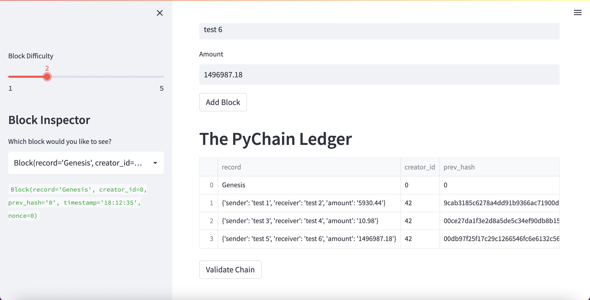
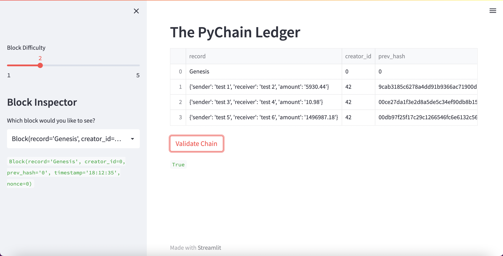
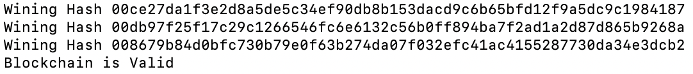

# FinTech Module 1

## Overview

This repository contains code for Module 1

The tasks for this module were to:

1. Create a new data class named Record. This class will serve as the blueprint for the financial transaction records that the blocks of the ledger will store.

2. Change the existing Block data class by replacing the generic data attribute with a record attribute that’s of type Record.

3. Create additional user input areas in the Streamlit application. These input areas should collect the relevant information for each financial record that you’ll store in the PyChain ledger.

4. Test your complete PyChain ledger.

## Testing Checks

For #4 above, refer to the following screenshots that test this blockchain implementation.

### Sample blockchain with multiple blocks:

### Testing validity of blockchain process:

### Additional confirmation:

